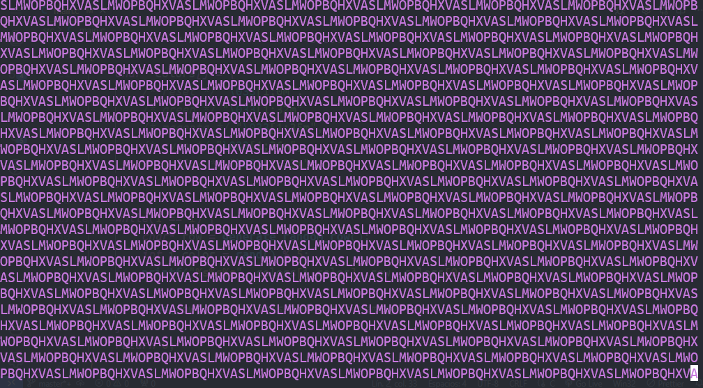

<div align="center">
    <h1>"Matrix" effect in C</h1>
</div>



I decided to make this "*matrix*" effect just for fun. I don't know much C so if you spot anything that could be done better, please let me know!

It's not like the matrix effect we all know, it's more like random letters being printed with random colors. But it's still pretty fun to see.

It's configured with CMake and it has no external dependencies. It should be pretty easy to compile.

Just configure cmake:
```sh
cmake -S . -B build
```
> You may want to set CMAKE_BUILD_TYPE to Release unless you're using a multi-configuration tool.

And then build it:
```sh
cmake --build build/
```

If you are using multi-configuration tools, to build in release you can run: 
```sh
cmake --build build/ --config Release
```

That should be it. Enjoy!

# License
Licensed under the MIT License.

See [LICENSE](LICENSE) for details.